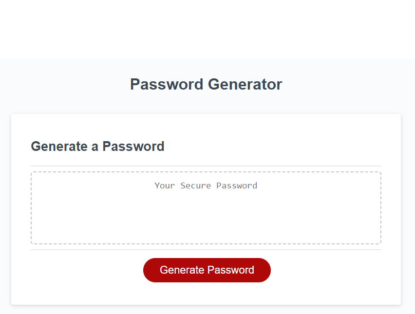

# Challenge 3: JS Password Generator

## Description

The objective of this project is modify starter code to generate a unique password based on the specifications selected by the end user. This is a slightly better alternative to making up passwords yourself.

Lessons learned:

Please refer to the many safe/secure practices for passwords.

I recommend <https://www.cisa.gov/news-events/news/choosing-and-protecting-passwords>

If you prefer to make your own password, please consider reviewing this article by Better Buys
Estimating Password Cracking Times
<https://www.betterbuys.com/estimating-password-cracking-times/>

## Installation

None.

## Usage

- In your preferred browser, open URL: <https://19dbo91.github.io/challenge3-password-gen/>
- Click the button to generate a password

You will be presented with a series of prompts for password criteria

- Choose a length of at least 8 characters, but no more than 128 characters
- Select what you want to include from the following crieria:
  - Lower Case
  - Upper Case
  - Number
  - Special Characters
  
A password will be displayed in an alert or written to the page.

- Copy and store the password somewhere safe

Preview:

## Credits

Starter code: UCI BootCamp

Referenced Links:

- <https://www.ascii-code.com/>
- <https://www.w3schools.com/>
- <https://developer.mozilla.org/en-US/docs/Web/>

## Features

- Special Characters (All other printable characters as defined in <https://www.ascii-code.com/>, not including SPACE or DELETE)
